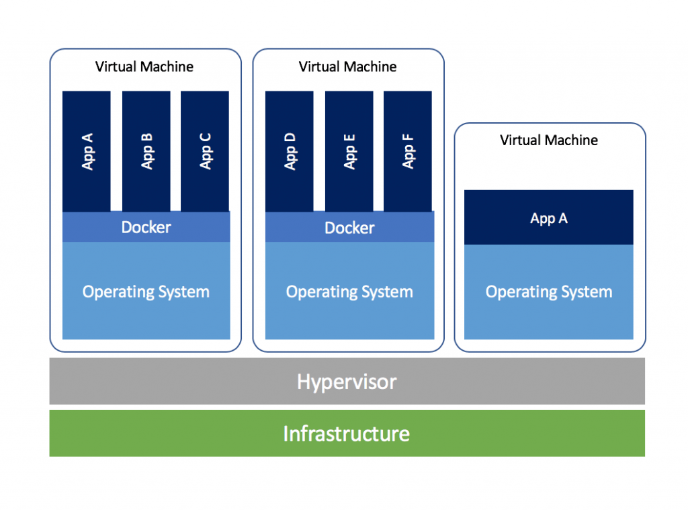

# Docker

## Virtual machines and Docker containers

### Virtual machine

"Virtual machines have __a full OS with its own memory management installed with the associated overhead of virtual device drivers__. In a virtual machine, valuable resources are emulated for the guest OS and hypervisor, which makes it possible to run many instances of one or more operating systems in parallel on a single machine (or host). __Every guest OS runs as an individual entity from the host system.__"

### Docker containers

"On the other hand Docker __containers are executed with the Docker engine__ rather than the hypervisor. Containers are therefore __smaller than Virtual Machines and enable faster start up with better performance, less isolation and greater compatibility possible due to sharing of the host’s kernel.__"

[](https://dodas-ts.github.io/SOSC-2018/img/docker1.png)

### Containers on virtual machines

[](https://dodas-ts.github.io/SOSC-2018/img/docker2.png)

## Deploy services whitin container

For Docker installation and fundamentals you can visit [this page](https://docs.docker.com/get-started/). For time reason it has already been installed on DEMO machines.

### Deploy a webserver

We can deploy a webserver within a container with the following command. Please notice that inside the container the port used is the standard one (80), but with the option -p one can map that port to one of choice on the host system.

``` bash
sudo docker run -dit --name my-apache-app -p 4880:80 httpd:2.4
```

In both cases the home webpage should appear on `localhost:4880`.

__N.B.(1/2) to learn how to build a docker image please visit [here](https://docs.docker.com/get-started/part2)__

__N.B.(2/2) a public repository for any container that want to be shared are collected into "registries", the Docker official one is [DockerHub](https://hub.docker.com)__